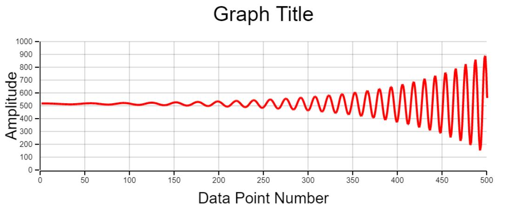

# Graphy - A fast JavaScript Graphing Library 

### Intro:

Graphy is a fast, JavaScript graphing library that was written as part of a Gravitational Wave exhibit at the Royal Society in 2017. The idea was to have a flexible, fast customisable way of displaying data from a Michaelson Interferometer on display. This only supports passing in of data to be displayed on the Y axis (we didn't need anything else), the x-axis will just be the data point number.



### Usage:

First initialise the library like so

```javascript
graphy = new Plot();
graphy.initialisePlot();
```

Set some options (see below), get the input data and plot it like so, 

```javascript
graphy.plotData(graphData);
```

An example file graph_test.html is included, containing data generation and sample plotting. 

## Options:

Many options can be changed, these are detailed below.

#### Data options: 

```javascript
graphy.dataMax = 1000; //Max value for the data
graphy.dataMin = 0; // Minimum value for the data
graphy.dataLength = 500; // Length of data
```

#### Line Colour:

Can be specified for, xAxis, yAxis, xGrid, yGrid and point.

```javascript
graphy.lineColour.xAxis = "rgba(0,0,0,0.5)"; // Colour of the x axis
graphy.lineColour.yAxis = "rgba(0,0,0,0.5)"; // Colour of the y axis
graphy.lineColour.xGrid = "rgba(0,0,0,0.5)"; // Colour of the x grid
graphy.lineColour.yGrid = "rgba(0,0,0,0.5)"; // Colour of the y grid
graphy.lineColour.point = "rgba(0,0,0,0.5)"; // Colour of the graph points
```

#### Line Width:

Can be specified for the xAxis, yAxis, xGrid, yGrid, xTick, yTick and point.

```javascript
graphy.lineWidth.xAxis = 2; // Line width of X axis
graphy.lineWidth.yAxis = 2; // Line width of Y axis
graphy.lineWidth.xGrid = 2; // Line width of grid in X axis
graphy.lineWidth.yGrid = 2; // Line width of grid in Y axis
graphy.lineWidth.xTick = 2; // Line width of tick marks on x axis
graphy.lineWidth.yTick = 2; // Line width of tick marks on Y axis
graphy.lineWidth.point =2; // Line width of graph point 
```

#### Font Colours: 

Can be specified for xLabel, yLabel, title, xTick and yTick.

```javascript
graphy.fontColour.xLabel = "rgba(0,0,0,1)"; // X label font colour
graphy.fontColour.yLabel = "rgba(0,0,0,1)"; // Y label font colour
graphy.fontColour.title = "rgba(0,0,0,1)"; // Title font colour
graphy.fontColour.xTick = "rgba(0,0,0,1)"; // X tick mark font colour
graphy.fontColour.yTick = "rgba(0,0,0,1)"; // Y tick mark font colour
```

#### Font Size:

```javascript
graphy.fontSize.xLabel = 30; // X label font size
graphy.fontSize.yLabel = 30; // Y label font size
graphy.fontSize.title = 40; // Title font size
graphy.fontSize.xTick = 15; // X tick mark font size
graphy.fontSize.yTick = 15; // Y tick mark font size
```

#### Font Type:

Can be any web-safe or installed font

```javascript
graphy.fontType.xLabel ="Arial"; // Font of the X axis label
graphy.fontType.yLabel ="Arial"; // Font of the Y axis label
graphy.fontType.title ="Arial"; // Font of the graph title
graphy.fontType.xTick ="Arial"; // Font of the X axis tick labels
graphy.fontType.yTick ="Arial"; // Font of the Y axis tick labels
```

#### Text Labeling:

Labeling options, such as setting custom titles, labels, and positions can be done in the following way. 

```javascript
graphy.axisOption.xLabel ="Data Point Number"; // Title of X axis
graphy.axisOption.yLabel ="Amplitude"; // Title of Y axis
graphy.axisOption.title ="Graph Title"; // Graph Title
graphy.axisOption.xLabelAlign ="center"; // X axis title align, center, left, right
graphy.axisOption.YLabelAlign ="center"; // Y axis title align, center, left, right
graph.axisOption.titleAlign = "center"; // Graph title align, center, left, right
```

#### Plotting Options:

Here you can change whether to display grid lines, tick text labels, change the number of grid lines and change the tick lengths as follows. 

```javascript
graphy.plotOption.vertGridLines = true; // Displays vertical grid lines
graphy.plotOption.horGridLines = true; // Displays horizontal grid lines
graphy.plotOption.drawxTickText =true; // Draws X Tick Text
graphy.plotOption.drawyTickText = true; // Draws Y Tick Text
graphy.plotOption.numVertGridLines = 10; // Number of vertical grid lines
graphy.plotOption.numHorGridLines = 10; // Number of horizontal grid lines
graphy.plotOption.xTickLength = 10; // Length of X tick lengths
graphy.plotOption.yTickLength = 10; // Length of Y tick lengths
```

